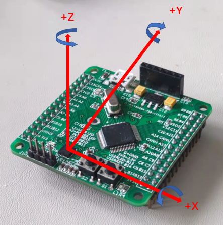
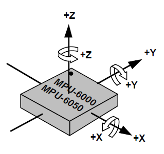

# Madgwick AHRS with MPU6050
This embedded system project achieved a high-frequency Madgwick AHRS based on the MPU6050 motion sensor and STM32F405 MCU, which can reach nearly 400Hz data rate when communicating with the ROS node.

The ROS node can be find here: https://github.com/Bungehurst/imu-ros-node

    
     

